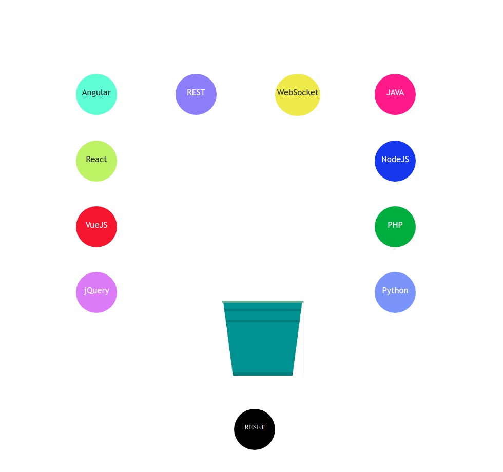

# MyPortfolio
An elaborate showcase of my projects, skills, articles and products that I am working on in my free bandwidth.

***

### Project FullStackBucket
A tutorial web platform where you chose the stack you want to learn, add them into bucket and, Voila!, you start leanring that stack by working on a customized project app has provided you with.

[Try Demo](http://www.buffalo.edu/~pdeshmuk/tuto.html)

